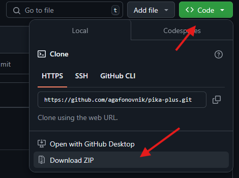

# pika-plus
Плагин, который скрывает посты pikabu-plus

# Quick Start

1. Скачайте архив с плагином и распакуйте его в удобную папку на вашем компьютере.

    

### Google Chrome

1. Откройте браузер Google Chrome.
2. Перейдите в меню, нажав на три точки в правом верхнем углу → Дополнительные инструменты → Расширения.
3. Включите Режим разработчика (переключатель в правом верхнем углу).
4. Нажмите кнопку Загрузить распакованное расширение.
5. Выберите папку, куда вы распаковали плагин, и нажмите ОК.
6. Плагин будет установлен и готов к использованию.

### Mozilla Firefox

1. Откройте браузер Mozilla Firefox.
2. В адресной строке введите about:debugging и нажмите Enter.
3. Перейдите в раздел Этот Firefox (в левом меню).
4. Нажмите кнопку Загрузить временное дополнение.
5. Выберите файл manifest.json из папки с распакованным плагином.
6. Плагин будет установлен и готов к использованию.

### Microsoft Edge

1. Откройте браузер Microsoft Edge.
2. Перейдите в меню, нажав на три точки в правом верхнем углу → Расширения.
3. Включите Режим разработчика (переключатель в левом нижнем углу).
4. Нажмите кнопку Загрузить распакованное расширение.
5. Выберите папку, куда вы распаковали плагин, и нажмите ОК.
6. Плагин будет установлен и готов к использованию.

### Safari

1. Откройте браузер Safari.
2. Перейдите в меню Safari → Настройки → Вкладка Расширения.
3. Включите Режим разработчика (если он не включен).
4. Перетащите файл .safariextz или папку с плагином в окно расширений Safari.
5. Подтвердите установку плагина.
6. Плагин будет установлен и готов к использованию.

### Opera

1. Откройте браузер Opera.
2. Перейдите в меню, нажав на иконку Opera в левом верхнем углу → Расширения → Расширения.
3. Включите Режим разработчика (переключатель в правом верхнем углу).
4. Нажмите кнопку Загрузить распакованное расширение.
5. Выберите папку, куда вы распаковали плагин, и нажмите ОК.
6. Плагин будет установлен и готов к использованию.
